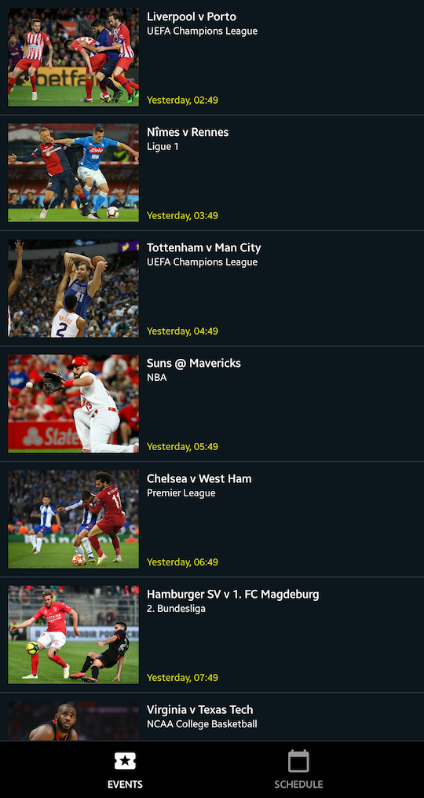
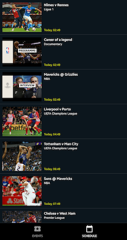
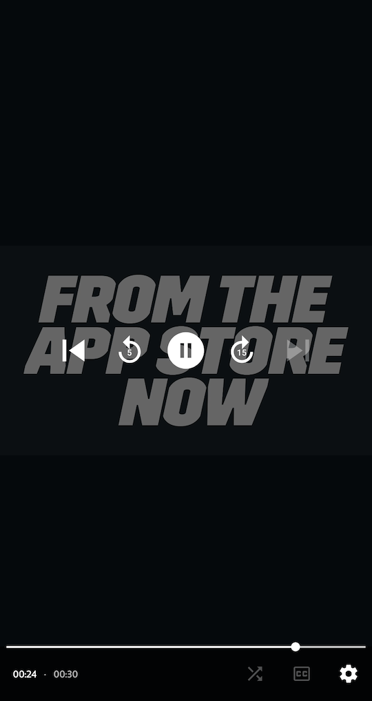

# DAZN Code Challenge - Android TV 

This was a code test project I have submitted as a part of the interview process. The project covers
common RESTApi, SQLite, RecyclerView, Constraint Layout, MVVM, plus dependency injection and
testings.

Although the title carries "Android TV", it has nothing to do with that - this is an Android mobile
App as required by the specifications. Except for a portion of open-source codes attributed inline,
this project was completed by myself alone.

Under the commit history, you will see how I have built everything from scratch - with rounds of
refactoring and bug fixes. The interview process was concluded in October, 2021, but I am still keep
on improving the codes for demonstration purpose.

I still have a plan to further rewrite this App using Jetpack Compose. However, since it is not likely that I will work for DAZN in the future, this may not happen so soon as I give priority to other projects.

Please note that the APIs are supplied by DAZN for recruitment purpose. They may not work at any
time, as we have already concluded the interview process.

## Screenshots

  

## Status

This project is already getting outdated as at July 2022. Future changes, if I still have time,
would be:

* LiveData to Kotlin Flow migration (now it's a bad practice to use LiveData in data layers)
* Better Coroutines dispatchers handling
* Jetpack Compose UI & new UI tests (major rework)
* ExoPlayer upgrade
* Truth to Kotest migration
* Retrofit to Ktor migration Basically it is a complete rewrite. However I guess I won't be offered
  a role at DAZN even I keep on improving this project. Therefore currently this is a low priority
  work.

## High level architecture

* Kotlin
* MVVM architecture
* [Jetpack Databinding](https://developer.android.com/jetpack/androidx/releases/databinding)
* Live Data
* Bottom Navigation
* [Github Actions](https://github.com/features/actions) - CI (current)
* [Bitrise](https://https://app.bitrise.io/) - CI (previously)

## Key Dependencies

* [kotlinx.coroutines](https://github.com/Kotlin/kotlinx.coroutines)
* [Jetpack ConstraintLayout](https://developer.android.com/jetpack/androidx/releases/constraintlayout)
* [Jetpack Navigation](https://developer.android.com/jetpack/androidx/releases/navigation)
* [Jetpack Lifecycle](https://developer.android.com/jetpack/androidx/releases/lifecycle)
* [Jetpack Room](https://developer.android.com/jetpack/androidx/releases/room) - Database

* [Retrofit](https://square.github.io/retrofit/) - RESTAPI
* [Moshi](https://github.com/square/moshi) - RESTAPI
* [Glide](https://github.com/bumptech/glide) - Network Image
* [ExoPlayer](https://github.com/google/ExoPlayer) - Media Player
* [Dagger Hilt](https://dagger.dev/hilt/) - Dependency Injection
* [Truth](https://truth.dev/) - Assertion Library for Testing
* [Timber](https://github.com/JakeWharton/timber) - Logging
* [LeakCanary](https://github.com/square/leakcanary) - Leak detection
* [Ktlint Gradle](https://github.com/jlleitschuh/ktlint-gradle) - ktlint plugin to check and apply
  code autoformat

## Requirements

* Android Studio Iguana | 2023.2.1 Canary 18
* Android device or simulator running Android 9.0+ (API 28)

## Setting up the keystore

* You don't need to setup a keystore to run the debug build. The following instructions are required only if you want to produce the release build.

* Android keystore is not being stored in this repository. You need your own keystore to generate
  the apk / App Bundle

* To ensure sensitive data are not being pushed to Git by accident, the keystore and its passwords
  are kept one level up of the project folder, so they are not managed by Git.

* If your project folder is at `/app/dazn-code-challenge/`, the keystore file
  and `keystore.properties` should be placed at `/app/`

* The format of `keystore.properties` is:
  ```
     store=/app/release-key.keystore
     alias=<alias>
     pass=<alias password>
     storePass=<keystore password>
  ```

## Unit tests

* Tests can be executed on Android Studio, by choosing the tests to run
* Command line options are: ` ./gradlew testDebugUnitTest` and `./gradlew testReleaseUnitTest`

## Building the App

### Build and install on the connected device

   ```
   ./gradlew installDebug
   // or
   // ./gradlew installRelease
   ```

* Options are: `Debug`, `Release`
* Debug builds will have an App package name suffix `.debug`

### Build and sign a bundle for distribution

After August 2021, all new apps and games will be required to publish with the Android App Bundle
format.

   ```
   ./gradlew clean bundleRelease
   ```

### Build and sign an apk for distribution

   ```
   ./gradlew clean assembleRelease
   ```

* The generated apk(s) will be stored under `app/build/outputs/apk/`
* Other usages can be listed using `./gradelew tasks`
