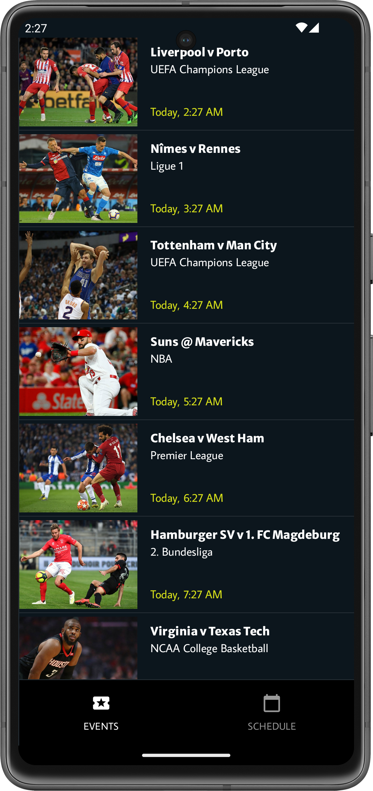
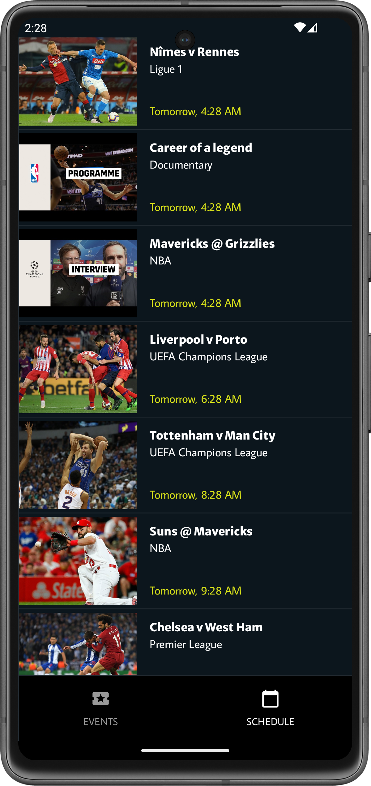
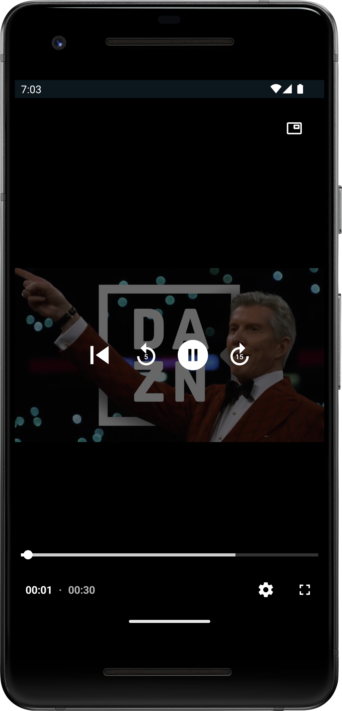
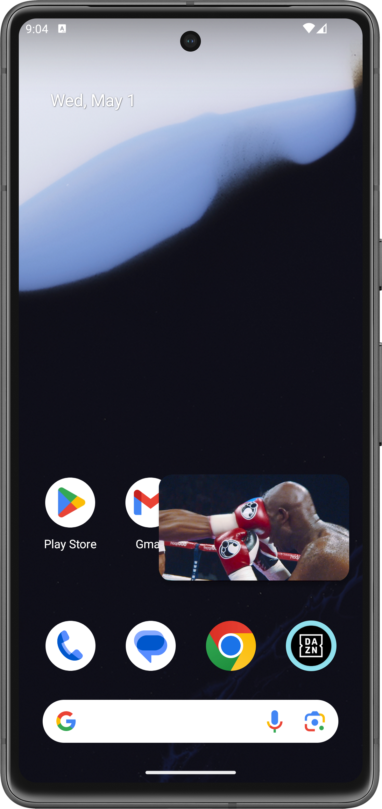
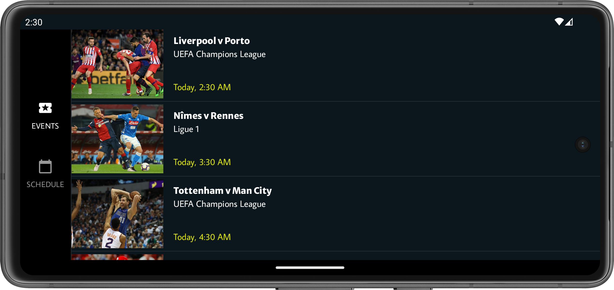

# DAZN Code Challenge  [](https://app.codacy.com/gh/ryanw-mobile/dazn-code-challenge/dashboard?utm_source=gh&utm_medium=referral&utm_content=&utm_campaign=Badge_coverage) [](https://app.codacy.com/gh/ryanw-mobile/dazn-code-challenge/dashboard?utm_source=gh&utm_medium=referral&utm_content=&utm_campaign=Badge_grade)

A responsive Android sample app written in Kotlin and Jetpack Compose, supporting different
navigation layout on screen sizes. The Media 3 Exoplayer is implemented on top of the single
activity architecture. It is fully functional with Picture-in-Picture support.

The events under the Events tab provides video playback.
The schedule under the Schedule tab refreshes automatically every 30 seconds.
For both tabs, you can always do swipe-to-refresh, or tap the navigation icon to scroll to the top
of the list.

## Download the App

If you want to try out the app without building it, check out
the [Releases section](https://github.com/ryanw-mobile/dazn-code-challenge/releases) where you can
find the APK and App Bundles for each major release.

&nbsp;

## History

This was a code test assignment as a part of the interview process. The task covered
common RESTApi, SQLite, RecyclerView, Constraint Layout, MVVM, plus dependency injection and
testings.

Although the title carries "Android TV", it has nothing to do with that - this is an Android mobile
App as required by the specifications.

The interview process was concluded in October, 2021, but I am still keep on improving the codes for
demonstration purpose.

The original XML View version is no longer maintained, you
can [access to the XML branch here](https://github.com/ryanw-mobile/dazn-code-challenge/tree/xml).

Please note that the APIs are supplied by DAZN in 2021 for recruitment purpose. They may not work at
any time.

## Screenshots

&nbsp;

<p align="center">
  
  
  
  
</p>
<p align="center">
  
</p>

&nbsp;

## To-do lists

Planned enhancements are
now [logged as issues](https://github.com/ryanw-mobile/dazn-code-challenge/issues?q=is%3Aopen+is%3Aissue+label%3Arefactor%2Cfeature%2Cfix%2Ctest).

## High level architecture

* Kotlin
* MVVM & clean architecture
* Jetpack Compose - Single Activity
* Kotlin Coroutines and Flow
* Dependency Injection using Dagger Hilt
* Material 3
* Dynamic screen layout support using Windows Size Class
* Jetpack Media 3 video player
* Gradle Kotlin DSL and Version Catalog
* Baseline Profile
* Full unit test and UI (Journey) test suite

### Dependencies

* [AndroidX Core KTX](https://developer.android.com/jetpack/androidx/releases/core) - Apache 2.0 - Extensions to Java APIs for Android development
* [AndroidX Media3](https://developer.android.com/jetpack/androidx/releases/media3) - Apache 2.0 - Media support libraries
* [JUnit](https://junit.org/junit5/) - EPL 2.0 - A simple framework to write repeatable tests
* [AndroidX Espresso](https://developer.android.com/training/testing/espresso) - Apache 2.0 - UI testing framework
* [Jetpack Compose](https://developer.android.com/jetpack/compose) - Apache 2.0 - Modern toolkit for building native UI
* [AndroidX Benchmark](https://developer.android.com/jetpack/androidx/releases/benchmark) - Apache 2.0 - Benchmarking library
* [AndroidX DataStore](https://developer.android.com/jetpack/androidx/releases/datastore) - Apache 2.0 - Data storage solution
* [AndroidX Legacy Support](https://developer.android.com/jetpack/androidx/releases/legacy) - Apache 2.0 - Legacy libraries
* [AndroidX Lifecycle](https://developer.android.com/jetpack/androidx/releases/lifecycle) - Apache 2.0 - Lifecycles-aware components
* [AndroidX Room](https://developer.android.com/jetpack/androidx/releases/room) - Apache 2.0 - Persistence library
* [Retrofit](https://square.github.io/retrofit/) - Apache 2.0 - A type-safe HTTP client for Android and Java
* [Moshi](https://github.com/square/moshi) - Apache 2.0 - A modern JSON library for Android and Java
* [OkHttp Logging Interceptor](https://square.github.io/okhttp/) - Apache 2.0 - Logging interceptor for OkHttp
* [Timber](https://github.com/JakeWharton/timber) - Apache 2.0 - A logger with a small, extensible API
* [Coil](https://coil-kt.github.io/coil/) - Apache 2.0 - An image loading library for Android backed by Kotlin Coroutines
* [MockK](https://mockk.io/) - Apache 2.0 - Mocking library for Kotlin
* [Robolectric](http://robolectric.org/) - MIT - A framework that brings fast, reliable unit tests to Android
* [Kotest](https://kotest.io/) - Apache 2.0 - Kotlin test framework
* [Hilt](https://dagger.dev/hilt/) - Apache 2.0 - A dependency injection library for Android that reduces the boilerplate of doing manual dependency injection
* [LeakCanary](https://square.github.io/leakcanary/) - Apache 2.0 - A memory leak detection library for Android
* [AndroidX Profile Installer](https://developer.android.com/jetpack/androidx/releases/profileinstaller) - Apache 2.0 - Install profiles for faster startup

### Plugins

* [Android Application Plugin](https://developer.android.com/studio/build/gradle-plugin-3-0-0-migration) - Google - Plugin for building Android applications
* [Jetbrains Kotlin Android Plugin](https://kotlinlang.org/docs/gradle.html) - JetBrains - Plugin for Kotlin Android projects
* [Hilt Android Plugin](https://dagger.dev/hilt/gradle-setup.html) - Google - Plugin for Hilt dependency injection
* [Compose Compiler Plugin](https://developer.android.com/jetpack/compose) - JetBrains - Plugin for Jetpack Compose
* [Kover Plugin](https://github.com/Kotlin/kotlinx-kover) - JetBrains - Code coverage tool for Kotlin
* [Ktlint Plugin](https://github.com/JLLeitschuh/ktlint-gradle) - JLLeitschuh - Plugin for Kotlin linter
* [Google DevTools KSP](https://github.com/google/ksp) - Google - Kotlin Symbol Processing API plugin
* [Android Test Plugin](https://developer.android.com/studio/test) - Google - Plugin for Android testing
* [Baseline Profile Plugin](https://developer.android.com/studio/profile/baselineprofile) - AndroidX - Plugin for generating baseline profiles

## Building the App

### Setting up the keystore

Release builds will be signed if either the keystore file or environment variables are set.
Otherwise, the app will be built unsigned.

### Local

* Android Keystore is not being stored in this repository. You need your own Keystore to generate
  the apk / App Bundle

* If your project folder is at `/app/dazn-code-challenge/`, the Keystore file
  and `keystore.properties`
  should be placed at `/app/`

* The format of `keystore.properties` is:
  ```
     store=/app/release-key.keystore
     alias=<alias>
     pass=<alias password>
     storePass=<keystore password>
  ```

### CI environment

* This project has been configured to support automated CI builds.

* The following environment variables have been set to provide the keystore:
  ```
     CI = true
     HOME = <the home directory of the bitrise environment>
     CI_ANDROID_KEYSTORE_PASSWORD = <your keystore password>
     CI_ANDROID_KEYSTORE_ALIAS = <your keystore alias>
     CI_ANDROID_KEYSTORE_PRIVATE_KEY_PASSWORD = <your keystore private key password>
  ```

### Build and install on the connected device

This app has two build variants: `Debug` and `Release`. The most common build commands are:

* `./gradlew clean installDebug`
* `./gradlew clean instal`
* `./gradlew clean bundleRelease`
* `./gradlew clean assembleRelease`

The generated apk(s) will be stored under `app/build/outputs/`
Debug builds will have an App package name suffix `.debug`
